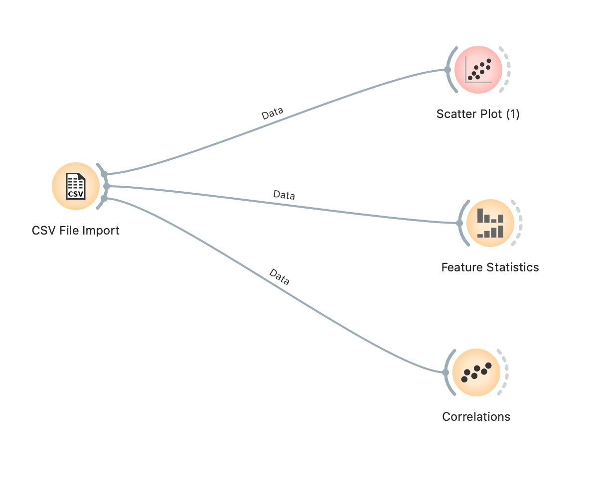

```
MO826 - Ciência e visualização de dados em saúde
1o. semestre de 2021
Instituto de Computação - Unicamp
Aluno: Edgar Kenji Tanaka
RA: 023577
```

# Laboratório 1
## Qual foi a ferramenta/linguagem escolhida?
Utilizei a ferramenta Orange. 

## Breve relato do seu processo de instalação/familiarização com a nova ferramenta
O processo de instalação é simples e não difere da instalação de outros aplicativos.
Como minha formação é em computação, achei que assistir o vídeo do professor André S. e um vídeo introdutório na tela de boas-vindas do Orange foram suficientes.
Não tive dificuldades pois realizei análises bastante simples. 
Minha dica para quem está começando é pegar um CSV pequeno e realizar análises estatísticas simples como neste laboratório.


## Descrição detalhada da análise realizada



## Conclusão após a realização da análise, revisitando a última pergunta da parte 1: os quatro conjuntos de dados correspondem ao mesmo fenômeno?

Fique à vontade para escrever no relatório suas epifanias, críticas e sugestões à atividade.
